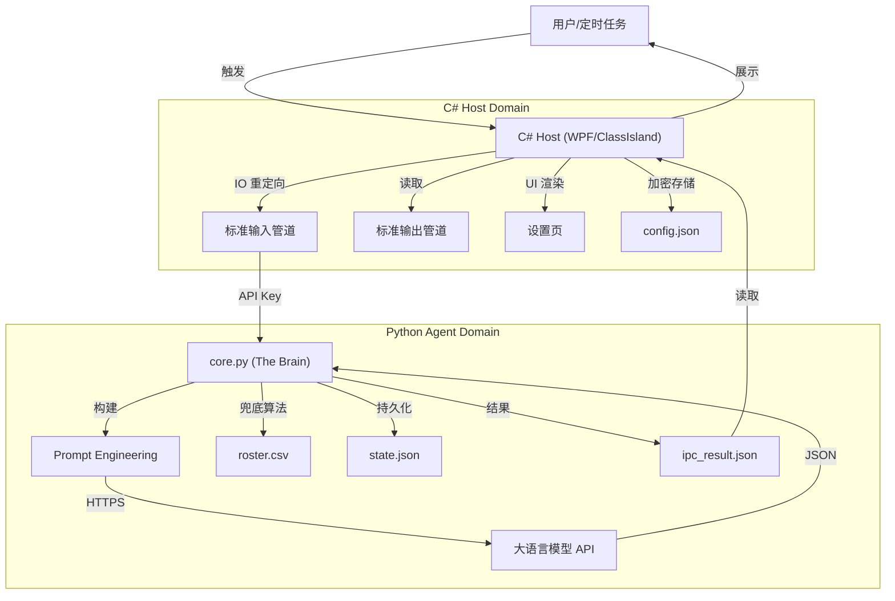

# Duty-Agent 架构与 AI 交互分析报告

> **文档版本**: v2.5
> **最后更新**: 2026-02-19

---

## 1. 项目总览 (Overview)

**Duty-Agent** 是一个专为 [ClassIsland](https://github.com/ClassIsland/ClassIsland) 设计的下一代智能排班插件。它并非简单地用 AI 生成随机数，而是构建了一个**“混合智能 (Hybrid Intelligence)”**系统——通过将大语言模型 (LLM) 的**灵活性**（理解自然语言指令）与 Python 代码的**确定性**（算法兜底、状态持久化）深度融合，解决了传统排班算法无法处理的复杂场景。

### 1.1 系统架构 (System Architecture)

采用了经典的 **Host-Agent (宿主-代理)** 模式，实现了 UI 与逻辑的彻底解耦。



*   **Host (C#)**: 基于 .NET 8 WPF，负责 UI、系统通知、进程管理。它是“传话筒”，不感知排班逻辑。
*   **Agent (Python)**: 独立进程，负责 Prompt 构建、LLM 调用、结果解析、状态记忆。自成一体的设计确保了核心逻辑的可移植性与稳定性。

### 1.2 通信机制 (IPC Protocol)

为了最大化兼容性与安全性，我们采用了 **"Standard IO + File Exchange"** 模式：

1.  **Input (C# -> Py)**:
    *   **Context**: 序列化为 `ipc_input.json`（包含指令、配置、但不含 Key）。
    *   **Secret**: API Key 通过 `Stdin` 管道瞬时传输，**绝不落地**。
2.  **Output (Py -> C#)**:
    *   **Result**: 写入 `ipc_result.json`。
    *   **Log**: 实时写入 `stdout`，宿主实时捕获并显示在调试控制台。

---

## 2. 核心优势 (Core Advantages)

Duty-Agent 并不试图取代 Excel，而是为了解决 Excel 无法解决的问题：**"动态公平性"**。

### 2.1 真正的“公平性” (True Fairness via Debt)
*   **传统痛点**: 老式轮询算法是无状态的。若张三今天请假，算法明天就轮到李四，张三就“逃过一劫”。
*   **Duty-Agent 方案**: 拥有完整的记账系统。张三的缺席会被记录为 `Debt`（债务）。在下次排班时，系统会**强制**优先安排张三还债。即便软件重启，这份记忆也不会丢失。

### 2.2 自然语言驱动 (Natural Language Driven)
*   **交互革命**: 抛弃复杂的 UI 表单，解决传统算法完全无法解决的复杂情况。
*   **指令示例**:
    > *"下周一只要 1 个人，因为大扫除。另外张三要训练，别排他。但如果是周五，就还是 2 个人。"*
    AI 能自动解析其中的：日期逻辑、人数变量、软冲突（Training -> Skip & Debt）。

### 2.3 隐私与安全 (Privacy & Security First)
*   **匿名化 (Anonymization)**:
    *   所有名字都会分配一个ID，在名单被发送到云端处理时，出现的只有毫无意义的ID区间，您的花名册绝对不会以明文形式出现在LLM服务端的日志中。
    *   发送前: `{"instruction": "ID 15 is sick"}` (隐去姓名)
    *   接收后: `ID 15` -> `张三` (本地还原)
*   **企业级加密**:
    API Key 使用 AES-256 加密，并与**物理网卡 MAC 地址**绑定。即黑客把配置文件被拷贝到另一台电脑，也无法解密使用。

---

## 3. 关键特性与技术实现 (Technical Deep Dive)


### 3.1 提示词工程 (Prompt Engineering)

我们精心设计了 3-Part Prompt 结构：

#### A. System Prompt
定义了 **JSON Schema** 和 **CoT (思维链)** 要求。
```json
"thinking_trace": {
  "step_1_analysis": "Date is 2026-02-19. ID 5 is sick.",
  "step_2_pointer_logic": "Debt Queue empty. Pointer moved to 6.",
  "step_3_action": "Scheduled 6."
}
```

#### B. User Prompt (Dynamic)
每次动态注入上下文：
```markdown
ID Range: 1-50
Disabled IDs: [5, 12] (自动计算)
Last ID: 48 (Main Pointer)
CURRENT DEBT LIST: [2] (v2.5 新增)
PREVIOUS MEMORY: "ID 2 skipped due to training."
Instruction: "排明天"
```

#### C. notes
AI上一次留下的自然语言记忆将会被注入提示词，解决了长期运营的问题

### 3.2 状态管理 (State Persistence)

所有记忆存储在 `Assets_Duty/data/state.json`。

*   `schedule_pool`: 历史排班记录（用于去重、回显）。
*   `next_run_note`: AI 的自然语言记忆。
*   `debt_list`: **Python 维护的债务列表** 。

**原子写入**: 使用 `write -> fsync -> rename` 策略，防止断电导致记忆文件损坏。

### 3.3 结构化债务追踪 (Structured Debt Enforcement) —— **v2.5**

这是系统的“安全气囊”，彻底解决了 LLM “偶尔眼花”的问题。

*   **Prompt 注入**: User Prompt 包含显式指令：
    `CURRENT DEBT LIST (PRIORITY HIGH): [12, 15]`
    告诉 AI：“这几个人是债主，必须先排。”
*   **Force Insert (强制插入)**: Python 代码逻辑。
    *   在获取 AI 结果后，Python 运行 `force_insert_debts`。
    *   **逻辑**: 如果 AI 没有安排债主，Python 会**暴力**将债主 ID 插入到排班列表的最前端。
*   **Self-Healing (自愈账本)**:
    每次运行结束，Python 自动重新计算：
    `state.debt_list = (旧债务 + 新增债务) - 实际排班人数`
    确保账本永远是平的。

### 3.4 双队列机制 (The Two-Queue Protocol)

这是解决“连续 ID 排班”核心数学难题的 Prompt 算法：

| 队列 | 定义 | 行为逻辑 |
| :--- | :--- | :--- |
| **Debt Queue** | 因故（请假/冲突）暂缓值日的人 | **Priority 0** (最高优先级)。必须先清空此队列。 |
| **Main Pointer** | 全局轮询进度 | **Monotonic** (单调递增)。只进不退，永远指向“下一个新人”。 |

**运行逻辑**:
1.  **Check Debt**: 队列有人吗？有 -> **优先排**。
2.  **Move Pointer**: 既然 Debt 处理完了（或空的），移动 Main Pointer 取新人。
    *   新人请假？ -> **加入 Debt**，指针继续前移。
    *   新人可用？ -> **排班**。


---

## 4. 技术演进史 (Evolution History)

| 版本 | 核心变革 | 解决的问题 |
| :--- | :--- | :--- |
| **v1.0** | 简易填空 | C# 算死日期，Python 只负责联系 AI 填人名。僵硬，无法动态调整。 |
| **v2.0** | 显式日期驱动 | AI 自主决定排哪几天。支持了非连续排班 (e.g. "下周一三五")。 |
| **v2.3** | Two-Queue | 引入双队列算法。解决了“插队会导致全班顺序乱套”的难题。 |
| **v2.4** | AI Memory | 引入 `state.json`。重启软件不再导致 AI 失忆。 |
| **v2.5** | **Structured Debt** | 引入 `Force Insert`。从“信任 AI”转向“AI 推理 + 代码保障”，实现了 100% 的公平性兜底。 |

---

## 5. 总结 (Conclusion)

Duty-Agent v2.5 的架构体现了 **Agentic AI** 的核心哲学：

> **"Reasoning via LLM, Reliability via Code."**

我们利用 LLM 强大的语义理解能力来处理复杂多变的人类指令（请假、软冲突、调休），同时利用 Python 代码的严谨性来保障核心规则（公平性、去重、状态一致性）。

随着 **Structured Debt Enforcement** 的实装，Duty-Agent 已经不仅是一个排班工具，而是一个值得信赖的、具备职业道德的智能管家。
