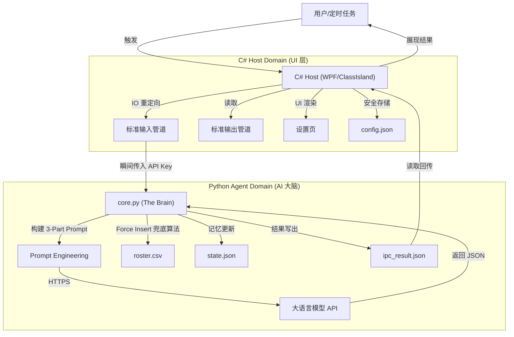

<div align="center">
  
  <h1>Duty-Agent</h1>
  <p><em>"Reasoning via LLM, Reliability via Code." —— 面向 ClassIsland 的下一代混合智能排班系统</em></p>
  <p><strong>当前版本: v0.40 Beta</strong></p>
</div>

> **注意：项目理论上的逻辑已经通过，正在真实环境下测试以验证稳定性和优化细节。如果您需要在生产环境中应用，请稍等正式版。**

`Duty-Agent` 是一个专为 **[ClassIsland](https://github.com/ClassIsland/ClassIsland)** 设计的下一代智能排班插件。它首创了 **“混合智能”** 架构——将大语言模型 (LLM) 的**灵活性**（理解自然语言指令）与 Python 代码的**确定性**（算法兜底、状态持久化）深度融合，彻底解决了传统排班算法（如轮询、随机）僵硬且无法处理复杂人事变动的痛点。

---

## 🌟 为什么选择 AI 驱动的排班？
  
| 特性 | 🟢 传统算法  | 🚀 Duty-Agent  |
| :--- | :--- | :--- |
| **指令输入** | 僵硬的表单 (开始日期, 结束日期, 人数) | **自然语言** ("下周三个人，张三缺席") |
| **复杂约束** | 难以配置 ("周二不排篮球队", "后天要大扫除") | **一句话搞定** (直接告诉 AI 规则即可) |
| **突发调整** | 需要手动重排表格、修改数据 | **智能识别** ("重新排，把王五换成赵六") |
| **公平保障** | 机械轮询，请假容易导致整体乱序 | **Debt & Credit 双向对冲机制** (确保100%劳动量守恒公平) |
| **维护成本** | 规则增加导致代码和配置呈指数级复杂 | **零配置** (规则通过 Prompt 解耦，免改代码) |

---

## ✨ 核心特性大揭秘

### 1. ⚖️ The Humanity Protocol 
传统的排班算法只在乎“填坑”，而 Duty-Agent 更在乎“公平”。
*   **结构化债务**: 系统的“安全气囊”。如果张三因病或活动跳过了值日，系统会将其永久标记为 **欠债**。在下次排班时，**Python 底层代码会强制优先安排张三还债**，彻底杜绝了 LLM 偶尔的“幻觉”遗漏。
*   **自愈账本**: 每次排班结束，系统自动清算账单，确保长期的绝对公平。

### 2. 🧠 AI Memory 
*   **状态管理**: Duty-Agent 拥有完整的状态管理 (`state.json`)。它能在下次启动时，注入先前的排班背景与自然语言记忆（如 "ID 12 上次请假了，下次记得补上"）。
*   **Three-Queue 双向对冲算法**: 内部维护 **Debt Queue (欠债优先池)**、**Credit Queue (功劳池)** 和 **Main Pointer (全局单向指针)**。不仅自动处理软约束跳过，而且当**人工手动进行人员微调替换**时，C# 宿主层能毫秒级提取变动差集进行 Debt/Credit 结算对冲。无论多少人请假插队、或者被上帝之手额外安排工作，全员总劳动量永远绝对公平、守恒。

### 3. 🤔 动态提示词工程
系统不是简单地问 AI 问题，而是构建了严密的推理链条：
*   **System Prompt**: 规定 JSON Schema，并要求 AI 输出 **CoT (思维链)**（先分析日期、再判断指针、最后输出行动）。
*   **User Prompt**: 动态注入人数、可用名单、全局指针、甚至**债务黑名单**。
*   **Notes 注入**: 将 AI 上次的“反思”作为上下文送入本次思考。

### 4. 🔒 隐私与安全
*   **绝对匿名**: 在发送给 LLM 之前，所有学生/员工的名字都会被替换为无意义的 ID (例: `张三 -> ID 15`)，本地接收后再还原。花名册详情**绝对不会**泄露给云端。
*   **金融级加密保护**: API Key 采用 `AES-256-CBC` 加密，并与本机**物理网卡 MAC 地址绑定**。即使配置文件被盗，在其他设备上也无法解密。Key 仅通过内存管道传输，绝不落地。

### 5. 🔌 开放标准支持
实现了 **Streamable HTTP MCP** 标准，不仅是一个插件，更是一个 **Tool Provider**。外部高级 AI（如 Cursor, Windsurf，CherryStudio）可通过 MCP 直接读取和操作排班。

---

## 🏗️ 系统架构设计

系统采用 **Host-Agent (宿主-代理)** 模式，通过 **Standard IO + File Exchange** 实现了 UI 与核心逻辑的彻底解耦。



---

## ⚙️ 阶段性事件

*   **v1.0**: 纯填空模式，C# 算死日期，缺乏灵活性。
*   **v2.0**: 对LLM能力进行了测试，确定了使用推理模型。
*   **v2.1**: 引入显式日期驱动，AI 自主决定排班范围。
*   **v2.2**: 引入 **Two-Queue** 双队列算法，解决复杂插队难题。
*   **v2.3**: 引入 **AI Memory** 持久化，软件重启也能记住。
*   **v0.30 Beta**: 引入 **Structured Debt Enforcement (结构化债务)** 与 **代码级强制兜底机制**，真正实现“利用大语言模型推理，利用代码保障可靠”。
*   **v0.40 Beta**: 架构升维至 **Three-Queue (Debt/Credit/Pointer)** 对冲模型，引入Credit机制，并在 C# 宿主层接管手动编辑的人员差分运算，实现跨语言排班因果绝对闭环。

---

## 📂 目录结构

```text
Duty-Agent/
├── Services/                  # C# 宿主服务 (负责 UI, 通知, 进程管控)
│   ├── DutyBackendService.cs  # 核心业务桥梁
│   └── SecurityHelper.cs      # AES-256-CBC MAC 绑定加密模块
├── Assets_Duty/               # Python Agent 核心 (负责智能逻辑)
│   ├── core.py                # 混合智能主程序 (The Brain)
│   ├── test_core.py           # 单元测试 (含最新版本核心用例)
│   └── data/                  # state.json 状态记忆存储
├── Views/                     # UI 视图层 (WebView2 等)
└── README.md                  # 本文档
```

---

## 📝 许可

MIT License
